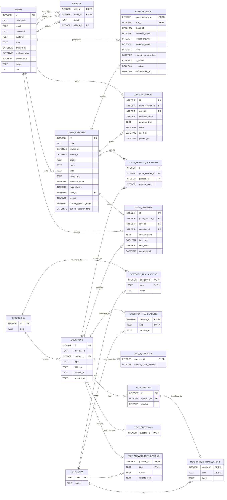

_This project has been created as part of the 42 curriculum by 1, 2, 3 and 4

### Quiz Sprint
**Quiz Sprint** is a competitive web-based quiz application designed to challenge your knowledge — solo or against friends. 
The goal of the project is to deliver an engaging and social quiz experience through a clean interface and real-time multiplayer gameplay.
Players can browse a variety of question categories and answer in two formats: multiple choice (MCQ) or free text input. 
The platform also includes a social layer, allowing users to search for other players, add them as friends, and visit their public profile pages.

In summary, you will find in this project :
	• Solo & multiplayer modes — play alone or challenge friends in real time
	• Multiple categories — a diverse selection of topics to test your knowledge
	• Question formats — MCQ and free-text answer types
	• User profiles — public pages displaying player stats and recent match history
	• Friends system — search, add, and follow other players

### Instructions 

##### Prerequisites

Make sure the following tools are installed on your machine before running the project:

| Tools | Version | Download|
|:-|:-:|:-|
| Docker| >= 24.x | docker.com |
| Docker-compose  | >= 2.x | Included with Docker Desktop |

##### Installation

1. Clone the repository
```sh
git clone 
cd ft_trans
```
/!\ repository adress may change due to school reglementation

Environment Setup
**This project use a secrets folder instead of a .env files.
To make things easier, a secrets-example folder is already provided  with the project**
2. Rename secrets-exemple to secrets
```sh
mv secrets-exemple secrets
```

3. Launch with docker-compose command
```sh
docker-compose up --build
```

The website will be available at https://localhost

> If some dockers error appears, don't hesitate to use docker system prune to clean your computer from similar dockers networks and else

### Resources

###### Documentation
- [Fastify](https://fastify.dev/docs/latest/) — Node.js web framework used for the backend API
- [React](https://react.dev/) — Frontend library
- [Docker Docs](https://docs.docker.com/) — Containerization and Docker Compose setup
- [ws — WebSocket library](https://github.com/websockets/ws) — Real-time multiplayer communication
- [better-sqlite3](https://github.com/WiseLibs/better-sqlite3) — SQLite database driver
- [JWT (jsonwebtoken)](https://github.com/auth0/node-jsonwebtoken) — Authentication token management
- [HashiCorp Vault](https://github.com/hashicorp/vault-guides/tree/master) - Vault github guide
- [i18n](https://react.i18next.com/) - i18n documentation


###### Articles & Tutorials
- [WebSockets in Node.js — A practical guide](https://ably.com/blog/web-app-websockets-nodejs)
- [Docker best practices for Node.js](https://snyk.io/blog/10-best-practices-to-containerize-nodejs-web-applications-with-docker/)
- [Ambar Hassani Medium](https://ambar-thecloudgarage.medium.com/hashicorp-vault-with-docker-compose-0ea2ce1ca5ab) - Vault applied to docker-compose

###### AI Usage
AI tools used during this project were only consulted as a technical assistant and learning purpose throughout the development process.

This has helped clarify API design conventions, understand new key concepts such as database usage, and facilitate learning the syntax of new languages such as JavaScript and SQL.

> All suggestions were reviewed, tested, understood, and adapted manually.  
> No code was copy-pasted from prompt


### Team Information

##### Product Owner (PO)
The Product Owner is responsible for defining the product vision and ensuring that its development meets user needs and project expectations. They manage and prioritize the backlog, make decisions about which features to develop, and validate the work done to ensure it meets the set objectives. They also play a key role in communicating with stakeholders, ensuring that requirements, feedback, and priorities are clearly conveyed. As part of our project, we have chosen to entrust this responsibility to 2, who performs these tasks while also participating in the development of the application.


##### Product Manager (PM)
The Project Manager/Scrum Master plays a central role in organizing and coordinating the team. They ensure that the project runs smoothly by planning meetings, monitoring task progress, and ensuring that deadlines are met. They also facilitate communication between team members, identify potential risks or obstacles, and help implement solutions to maintain effective progress. As part of our project, we have chosen to entrust this responsibility to 1, who performs these tasks while also participating in the development of the application.


##### Technical Lead
The Technical Lead/Architect is responsible for the technical vision of a project and the overall consistency of its architecture. They define structural choices, select the most appropriate technologies, and ensure compliance with best development practices in order to guarantee reliable, maintainable, and scalable code. They also play a key role in reviewing significant technical changes, anticipating risks related to performance, security, or scalability, and supporting the development team on the most complex technical decisions.
As part of our project, we have chosen to entrust this responsibility to 4, who carries out these tasks while also participating in the development of the application.

##### Developers
Developers are responsible for designing, developing, and integrating the various features of the project. They participate in writing code, reviewing code, testing implemented features, and documenting their work to ensure the quality, comprehensibility, and maintainability of the application. They also contribute to resolving technical issues and continuously improving the product. As part of our project, all members of the group play this role and actively participate in the development of the application.

#### Project Management:
The work was organized by module, with each team member taking ownership of a specific part of the project according to their preferences and working on a dedicated Git branch. This approach helped clarify responsibilities, improve autonomy, and simplify parallel development.

To ensure effective coordination, weekly synchronization meetings were held once or twice a week through **Discord** voice calls. These meetings were used to share progress updates, merge branches when necessary, assign upcoming tasks, and define internal deadlines. Discord also served as the team’s main communication platform, with dedicated channels for each module and area of work, including backend, frontend, database, and general coordination. In addition, **GitHub Projects** was used as a *Kanban* board to visually track the project’s progress, while *GitHub Issues* were used for task management and directly linked to the board for better visibility and organization.


#### Technical Stack:
As part of this project, the application was designed using modern technical architecture based on a frontend developed with React, integrating react-router-dom for navigation management, react-i18next for internationalization, and HTTP and WebSocket exchanges to ensure both traditional processing and real-time interactions.  The backend is based on Fastify and follows a microservices approach, with each API isolated in a separate Docker container to ensure better separation of responsibilities, easier maintenance, and greater scalability of the application as a whole. All of theses docker runing on the same sqlite databases as it is much more detailed as a mongodb, all by being easy to get on. 
This organization allows for a clear separation of different functional areas, such as quiz session management, response processing, secure authentication with JWT-tokens and cookie, and user-related features.
The choice of this architecture meets several technical objectives. 
On the one hand, the use of WebSocket allows for the efficient management of real-time events related to the progress of a game session, particularly for receiving server messages, managing power-ups, and synchronizing certain game states, such as friends requests. 
On the other hand, the use of separate APIs deployed in separate containers promotes a modular approach, in line with the principles of distributed architectures.

#### Database Schema:




---

#### Features List:

##### Signin / Signup
- *Signin / signup with 2FA and JWT token (cookie-based)*

Implemented secure user authentication using JWT tokens stored in HTTP cookies, combined with a two-factor authentication flow to protect accounts and ensure only verified users can sign in.

*Team member(s): 3*


###### Quiz

- *Solo / multiplayer quiz session creation with configurable settings*

Allows users to create quiz game sessions in solo or multiplayer mode, choosing parameters such as number of questions, themes or difficulty, before starting the game.
- *WebSocket usage for real-time interaction*

Uses WebSocket connections between client and server to handle live game events, such as question delivery, answer submissions and state updates, without page reloads.
- *Power‑ups via WebSockets*

Implements in‑game power‑ups (e.g. hints, option removal, score boosts) that are triggered and propagated in real time to all relevant players through WebSocket messages.
- *Real‑time state synchronisation*

Keeps the game state (current question, scores, timers, session status) consistent across all connected clients by broadcasting state changes from the server in real time.
- *Client-side quiz state persistence*

Stores part of the current game state on the client side, allowing the session to be restored after a page refresh or a short interruption instead of fully resetting the game

*Team member(s): 4, 2*


###### Social
- *User information and statistics retrieval*

Provides endpoints to fetch user profiles and gameplay statistics (such as number of games played, scores or win rate) so the frontend can display a personal dashboard.
- *Friend management with HTTP and real-time updates*

Includes features to send, accept or remove friendships so users can maintain a friend list, see other players’ status while keeping the social interface updated through standard API calls and real-time mechanisms when needed using Websockets.

*Team member(s): 4, 1*


###### Frontend
- *React-based frontend interface*

Delivers a single-page application built with React, managing navigation, forms and game views, and consuming the backend APIs and WebSocket streams.

- *Client-side routing with React Router*

Uses client-side routing to navigate between the main application views without reloading the page, improving fluidity and user experience in the React interface.
- *Multilanguage support with i18n*

Integrates an internationalisation library (i18n) so all main UI texts can be translated, letting users switch languages without changing the application logic.

*Team member(s): 2, 1*

###### Backend Architecture
- *Microservices architecture*

Structures the backend into multiple independent services (e.g. authentication, quiz, user/social), each responsible for a specific domain, to improve scalability and maintainability.
- *APIs separated by responsibility*

Exposes distinct REST endpoints for authentication, quiz management and user data, ensuring clear boundaries and simpler evolution of each API.

- *Containerised microservices deployment with Docker*

Deploys backend services in separate Docker containers, making the application easier to isolate, maintain and scale across functional domains.
- *SQLite database in a local volume*

Uses SQLite as the persistence layer, stored in a dedicated local volume, providing a lightweight, file‑based database that is simple to deploy in containers.

*Team member(s): 4*


---
### Modules

##### Major modules (2 points each) : 14 points
- *Implement a complete web-based game where users can play against each other : 2 points*

This module is the heart of our project; we decided to implement it to create a fun website that also allows everyone to learn
new trivia

It was implemented through the creation of quiz sessions, multiplayer mode, WebSocket exchanges, and real-time synchronization of game state between clients. All of this is handled on the backend by providing a dedicated service so that the site can remain functional even if a problem were to arise

*Team member(s): 4, 2*

- *Framework frontend and backend (react, fastify) : 2 points*

We chose to implement this module to challenge ourselves with modern technologies that allow us to keep up with trends while simplifying the management of user interfaces and backend communications.

The module was implemented throughout the project, using React with react-router and i18n, as well as Fastify for all API endpoints.

*Team member(s): 1, 2, 3, 4*


- *Implement WAF/ModSecurity + Hashicorp Vault : 2 points*

This decision stems from our desire to maintain a secure project, allowing us to explore the various methods companies use to prevent malicious users from accessing data.

This module was implemented first to retrieve the various variables contained in a secrets folder, which are then converted into an environment file for each service.
The data is encrypted and stored in the computer’s tmpfs, which prevents any external access as well as its destruction when the program is shut down.

*Team member(s): 4*


- *Standard user management and authentication : 2 points*

We felt this module was essential for creating a user management system that would allow us to identify everyone wishing to test our project, as well as enable them to customize their profiles and view statistical feedback on their games.

This module operates using its own service: *user*, which uses cookie-based authentication to retrieve and modify user information.

*Team member(s): 4, 1*

- *Backend as microservices : 2 points*

Breaking the system down into microservices improves the separation of concerns, maintainability, and the ability of services to evolve independently. This has also allowed us to better understand how the APIs function as a whole, while giving us insight into the project’s scalability potential.

This module is implemented by deploying several independent services, each with its own set of functions, while maintaining a shared dependency on the database. Each service has its own Dockerfile, all managed by a Docker Compose file to handle the initial launch of the project.

*Team member(s): 4*


- *Multiplayer game : 2 points*

We felt that choosing this module made sense, as it extends the gaming experience by allowing players to compete against their friends.

It was implemented by creating multiplayer sessions, with WebSocket communication enabling real-time synchronization during gameplay.

*Team member(s): 4,2*

- *Websocket : 2 points*

The decision to incorporate WebSockets into the project came naturally as a way to create a real-time immersive experience for the user, allowing them to better appreciate the project as a whole.

WebSockets are used to handle various in-game events, as well as to manage the friend system.

*Team member(s): 4, 2, 1*

---

##### Minor modules (1 point each) : 10 points
- *A gamification system to reward users for their actions : 1 point*

The value of this module lies in the importance we place on engaging users in our game. By providing rewards as they progress, we help them feel like active participants in the game—not just testers of a project.

This module is represented by various achievements for the user to unlock, a leaderboard on the home page, and badges. Users can also view a progress bar on their profile showing their progress toward the various objectives.

*Team member(s): 1*

- *GDPR compliance features : 1 point*

This module is legally justified by the right to erasure provided for in Article 17 of the GDPR, as well as by the obligation to respond to user requests regarding their personal data. 

To comply with this module, we allow users to access their data, which is available for download and can also be sent via email. Users also have the option to delete their account, and a confirmation email is sent to them during significant operations.

*Team member(s): 4, 2*

- *Game Statistics and match history : 1 point*

The decision to include this module is based on the same line of thinking as gamification. The inclusion of statistics and game history allows players to take the game more seriously and even compare themselves to friends, which enhances their experience and increases their playtime.

This module is implemented both on the backend in the user service and on the user’s profile page. It displays various statistics, such as the number of correct answers, the total number of answers, the number of wins, and the correct-to-total-answers ratio.
As for the match history, it is also available on the user’s profile page.

*Team member(s): 1, 4*

- *Module of choice (minor version) : 1 point*

To meet the requirements of this module, we decided to implement the Single Page Application (SPA) approach, which enables smoother navigation from the moment the page first loads, as well as improved performance, by minimizing the number of backend calls required.
This module is noteworthy because it demonstrates our commitment to delivering a modular website despite the increased complexity during development, while challenging us to work with a more complex yet modern technology.

Its implementation was therefore carried out from the very start of the project to ensure a clear separation between the frontend and the backend.

*Team member(s): 1, 2*

- *Support for additional browsers : 1 point*

We decided that implementing this module was necessary at this point to ensure that as many people as possible could access our website.

We therefore integrated this module throughout the project to identify and resolve any compatibility issues across different browsers, ensuring a consistent experience for everyone.

*Team member(s): 1, 2, 3, 4*

- *Game customization options  : 1 point*

We felt this module was relevant because it allows each player to enjoy a personalized quiz experience before each game starts.

It is implemented through various session creation settings, as well as directly on the profile page, where users can customize the game’s appearance.
This module includes power-ups, various site themes, and game customization options.

*Team member(s): 1, 2, 4*

- *Complete 2Fa system  : 1 point*

Since user security is a top priority for us, and we were curious about how an A2F system works, we decided to choose this module.

The A2F in our project is therefore an option that users can select to enhance security. This system works by sending an email directly to the address provided during account creation, combined with JWT authentication stored in a cookie.

*Team member(s): 3*

- *Multiple language : 1 point*

Since inclusivity is at the heart of our values, we decided that adding this module was not just an option but a necessity to ensure the site is accessible to as many people as possible.

To achieve this, we decided to implement multilingual support on the frontend using i18n, which currently allows us to translate the text into French, English, and Arabic to ensure the widest possible understanding.

*Team member(s): 2, 1*

- *Right-to-Left : 1 point*

In line with this approach, we felt that RTL was necessary to logically complement the multilingual support.

We are therefore reversing the direction of the entire site to maintain this inclusivity.

*Team member(s): 2, 1*


- *Custom-made design system with reusable components, including a proper color palette, typography, and icons (minimum: 10 reusable components) : 1 point*

In order to ensure consistency across the entire interface and maintain a uniform UI, we decided to meet the requirements of this module.
The site therefore uses the same color palette and typography throughout. These can be customized and selected by the user. However, all of these elements are handcrafted.

*Team member(s): 2, 1*

#### Total : 24 points

---


####  Individual Contributions:
	◦ Detailed breakdown of what each team member contributed.
	◦ Specific features, modules, or components implemented by each person.
	◦ Any challenges faced and how they were overcome.

#### 1
I started the project on the front side of it with 1. I immediately focused on the translation on the website since a quiz has a lot of text, it seemed really logical.
Since we knew we were gonna use React, I leaned towards i18n React. It was very easy to use, and so that's how I could add the RTL management so easily.

After that, I went to the design part of the website and did the design system. It was a bit hard at first because I had to consider that it's only a minor module, but at the same time a very complex and complete
one. With the help of the styles sheet that my teammate prepared, I could easily modify and work around the permanently changing styles.
While I was doing it, I was also working on the game customization by doing themes that could be used in game to amplify the gameplay experience.

Then I switched and went to do the backend, starting with the SMTP, to implement the GDPR compliance features. I knew it was useful for the 2FA so I did it first while doing the data export and data deletion.
But a problem I had was that I started using local storage but if the same account was connected multiple times, it would cause a lot of issues.
So I learned how to use Web Sockets so one call could work for multiple browers.

Speaking of Web Sockets, I did the powerups for the game as it requires backend and frontend exchanges.
Those worked both for the solo and multi part of the game. The main problem while doing this was associate the front with the back, both fetch and web sockets messages.


#### 2
Implemented a central WebSocket gateway to handle live interactions. This allows for instantaneous friend request notifications, game invitations, and real-time "Accept/Decline" logic without page refreshes. Developed a synchronization layer that tracks and broadcasts user "Online/Offline" status across the entire platform. The friend list and pending requests UI are automatically updated via socket events. Configured Vite’s Hot Module Replacement to work seamlessly behind an Nginx reverse proxy, resolving complex WebSocket handshake issues (WSS) and ensuring a stable development-to-production pipeline.

Engineered a high-performance ranking system that fetches and displays the Top 5 players globally, providing immediate competitive feedback to the user. Designed a comprehensive stats module using KPI (Key Performance Indicator) cards. It calculates and visualizes mission-critical data such as: Accuracy of answers over time. Total answers provided vs. successful wins. Created a scalable rewards architecture where "Titles" were refactored into "Badges." These are dynamically unlocked based on progression milestones and displayed with a custom global status bar.

Optimized the deployment workflow by implementing a multi-stage Docker build. This significantly reduces image size by separating the build environment from the production-ready Nginx static server.

Integrated a multi-language framework supporting English, French, and Arabic. Beyond simple translation, the UI was specifically refactored for Arabic support, including mirrored layouts for theme selection, question counters, and power-up modules to respect RTL design standards. User language choices are now captured at the landing page and seamlessly synchronized with the user profile upon account finalization.

#### 3
I used to implement a full authentication module to able a client to connect to the quizz website, fetching his email, username and the password when signup. For a persistent security it's important to hash the password and put it in the database. Implementing a complet 2fa security part, sending to the client email adress using the smtp protocol a 6 digits code when signup and signin. The JWT (Json Web Token) was also an important part of the job, in fact, this tool can give a state to the front server, keeping it with specific data the user had to interact with. Because we can't stop to think with security it's important we have to put this token in a specific and protected space of the browser called the cookies. The cookies work like a localStorage with a security asset. We can't compile js script inside, so we avoid xss attack. We can't stock the token inside the database, the back server auth microservice is returning the JWT using a specific algorithm when the user is authenticate. The challenge was technical, with deep web concept like 2fa, jwt, password hash algorithm and read the documentation was a big part of the job.

#### 4
My contribution to the project focused on both defining its architectural foundation and implementing essential application features.
I helped design the initial architecture by structuring the APIs, setting up the database, and integrating several technical infrastructure components, including Nginx and Vault.
I then took charge of a significant portion of the quiz module’s development, including the game’s functional logic on both the frontend and backend, communication with services, real-time management, and securing client-side persistence.

One of the main challenges was ensuring consistency between the project’s initial architecture, service-to-service communication, and the user interface’s behavior. I also had to ensure reliable synchronization between the frontend’s local state, data from APIs, and real-time events received during a session.  To address these constraints, I structured the state management logic, implemented error-handling mechanisms, properly reset certain data between requests, and set up local persistence solutions to make the application more robust and responsive during use.
- modules :
	game-customization, support fort additional browser, game statistics and match history, gdpr compliance, websockets, multiplayer game, backend as microservices, standard user management and authentication, Implement WAF/ModSecurity + Hashicorp Vault, Framework frontend and backend, Implement a complete web-based game where users can play against each other
